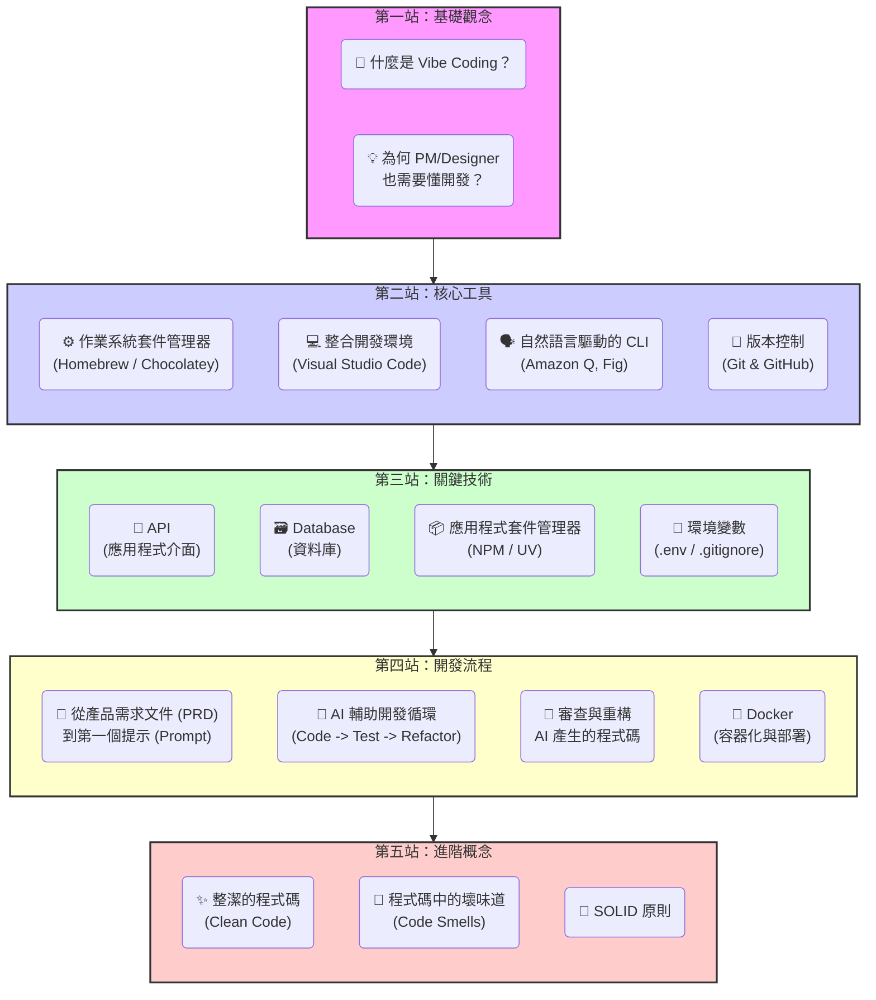
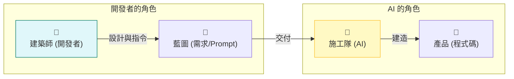
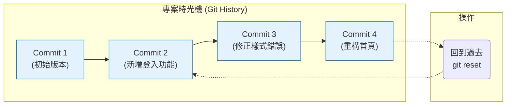
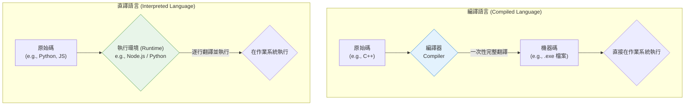
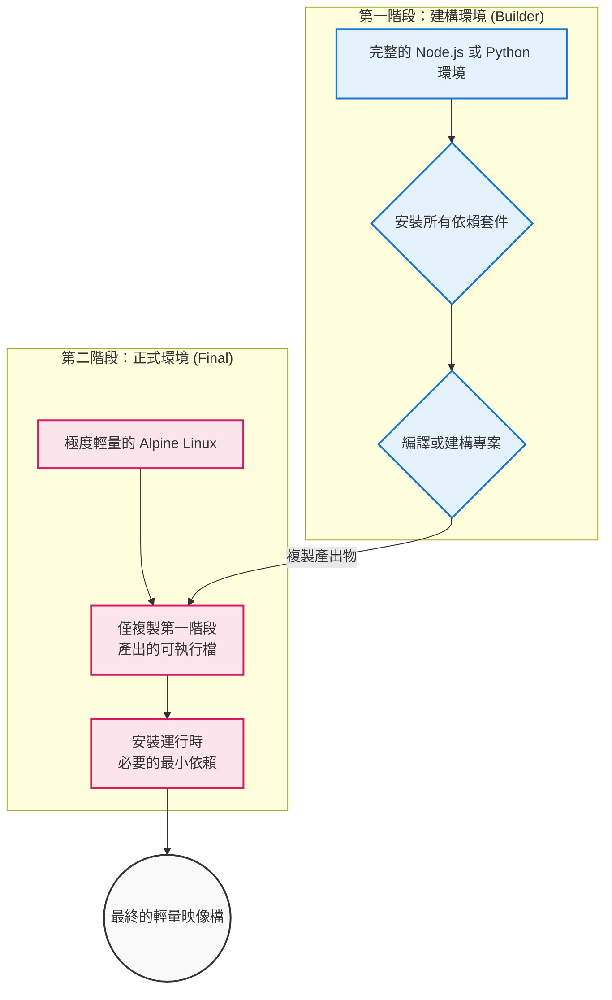
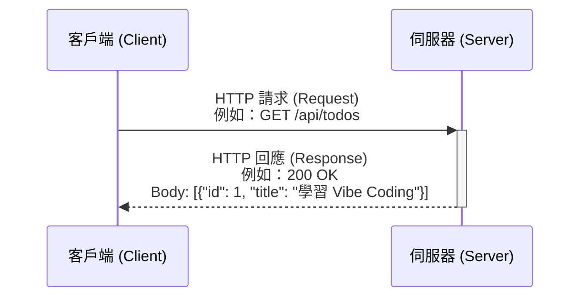
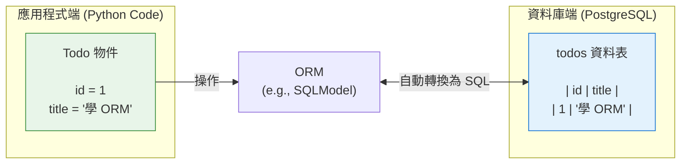
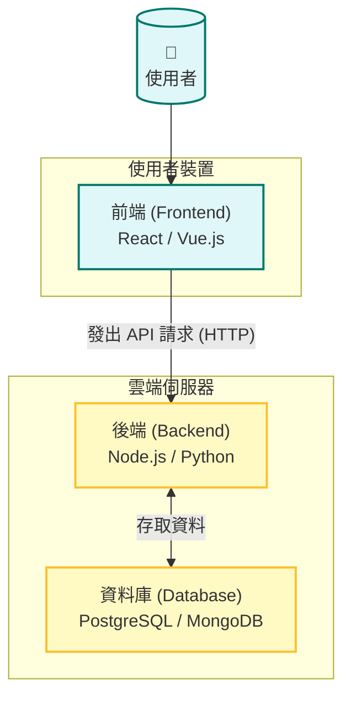
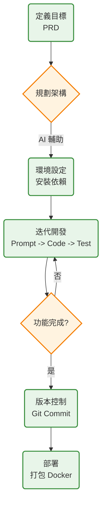
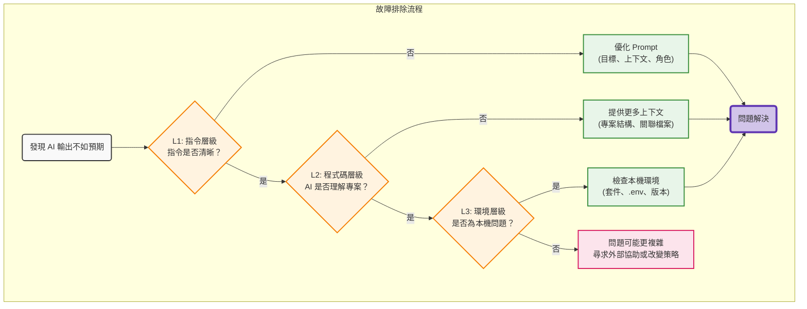

# Vibe Coding 工程師養成手冊

## 前言：歡迎來到 Vibe Coding 的世界

你好！歡迎來到 Vibe Coding 的世界。

這份手冊是為未來的 AI 協作開發者（稱之為 "Vibe Coder"）所設計。無論過去的專業背景為何，只要準備好與 AI 一同創造，這裡就是起點。

對於產品經理，Vibe Coding 可以是將 PRD 直接轉化為產品原型的工具；對於設計師，它可以是將 Figma 設計稿變為可互動網站的魔法。它讓人能跳過繁瑣的實作細節，更專注於產品的體驗與價值。

過去，學習程式設計就像學習一門需要精準記憶文法和單字的外語。而 Vibe Coding 更像是指揮一個極度聰明的施工團隊。開發者不再需要親自砌磚，但需要學會如何看懂藍圖、下達清晰的指令、驗收工程品質，並最終將成果交付出去。

本手冊將引導讀者一步步掌握這套「指揮」的藝術。讀完它，讀者將有能力引導 AI 開發出功能完整、品質合格的應用程式，並將其打包成可隨處部署的 Docker 容器。

準備好了嗎？讓我們開始建構第一個專案吧！

---

## 學習路徑圖

這張圖表描繪了 Vibe Coder 的學習之旅。從建立正確的觀念開始，接著掌握核心工具與關鍵技術，然後深入了解開發流程，最後邁向進階的軟體工藝。



---

## Chapter 1: 心法篇 - 成為一名合格的 Vibe Coder

在動手之前，需要建立正確的心態。作為 Vibe Coder，核心價值不在於「寫」程式，而在於「引導」和「驗證」。

### 1.1. 開發者是「建築師」，AI 是「施工隊」

開發者最重要的職責是規劃與設計。需要清楚地定義「要做什麼」，並將其拆解成一系列清晰、可執行的指令。AI 就是施工團隊，它會根據指令快速地建造。

- **開發者的工作**：定義需求、設計架構、拆分任務、驗收成果、回饋修正。
- **AI 的工作**：根據指令生成程式碼、撰寫文件、執行測試、修復 Bug。



### 1.2. 溝通的藝術：如何優雅地下指令（Prompting）

與 AI 溝通的媒介就是「提示」（Prompt）。提示的品質，直接決定了 AI 生成結果的品質。一個好的提示應該具備以下特點：

- **明確的目標**：清楚說明想要完成什麼。
- **足夠的上下文**：提供相關的背景資訊、程式碼片段或設計方向。
- **具體的限制**：指定使用的框架、函式庫、或程式風格。

> **一個不好的提示**：做一個登入頁面。
>
> **一個好的提示**：請使用 [`React`](https://react.dev/) 和 [`Tailwind CSS`](https://tailwindcss.com/) 框架，為網站設計一個登入頁面。頁面需要包含「電子郵件」、「密碼」兩個輸入框，以及一個「登入」按鈕。當使用者點擊登入按鈕時，呼叫一個名為 `handleLogin` 的函式。

### 1.3. 保持懷疑，持續改善：驗證與迭代

AI 非常強大，但並非全能，它也會犯錯。開發者的另一個核心職責就是「驗證」。永遠不要直接複製貼上 AI 生成的程式碼。

- **閱讀與理解**：嘗試讀懂 AI 寫的每一行程式碼，至少要理解其「意圖」。
- **測試與除錯**：實際執行看看，測試各種邊界情況。如果出錯了，將錯誤訊息連同目標一起回饋給 AI，讓它修正。
- **持續迭代**：開發是一個反覆修正的過程。第一次的結果不完美很正常，透過不斷的回饋與修正，逐步讓它達到要求。

---

## Chapter 2: 基礎篇 - Vibe Coder 的必備工具箱

工欲善其事，必先利其器。本章節將介紹所有在開發旅程中，需要了解的核心工具與概念。

### 2.1. 指令列介面（CLI）：與電腦直接對話

圖形介面（GUI）就像是餐廳的菜單，使用者只能點選上面有的選項。指令列介面（Command-Line Interface, CLI）則像是一個能聽懂指令的服務生，可以用文字下達更精確、更複雜的指令。

開發者不需要背下所有指令，只需要知道它的存在，並學會如何請 AI 協助產生指令。

> **常見需求**：
> - 「顯示當前資料夾路徑」 -> AI 會建議使用 `pwd`
> - 「列出當前資料夾的所有檔案」 -> AI 會建議使用 `ls -la`
> - 「建立一個名為 `project` 的新資料夾」 -> AI 會建議使用 `mkdir project`

主流的 AI 開發工具（如 Cursor）通常都內建了終端機（Terminal），這就是輸入指令的地方。

#### 2.1.1. 讓 AI 成為翻譯官：自然語言 CLI

對於初學者，記住各種 CLI 指令可能是一件頭痛的事。幸運的是，現在有工具可以將自然語言直接翻譯成電腦指令。

一個很好的例子是 [**Amazon Q Developer CLI**](https://github.com/aws/amazon-q-developer-cli)。安裝後，便可以用 `q` 指令來讓 AI 協助操作。

> **範例**：
> - 想要「找出所有大於 1MB 的日誌檔案」
> - 只需要在終端機輸入：`q find all log files larger than 1MB`
> - AI 就會自動產生對應的 `find . -name "*.log" -size +1M` 指令並執行。

這讓開發者幾乎可以完全專注在「想做什麼」，而不是「該怎麼下指令」，這正是 Vibe Coding 的精髓。

### 2.2. 作業系統的套件管理員：`Homebrew` 與 `Chocolatey`

在安裝各種開發工具（如 Git, Docker, Python）之前，建議先安裝一個「作業系統層級的 App Store」。它能讓使用者用簡單的指令來安裝和管理電腦上的軟體。

-   **macOS**: [**Homebrew**](https://brew.sh/index_zh-tw) 是標準選擇。安裝後，就可以用 `brew install <軟體名稱>` 來安裝工具。
-   **Windows**: 可以選擇 [**Chocolatey**](https://chocolatey.org/) 或微軟官方的 [**winget**](https://learn.microsoft.com/zh-tw/windows/package-manager/winget/)。

安裝好它之後，再安裝後續的開發工具會變得非常簡單。可以向 AI 提問：「請提供使用 Homebrew 安裝 Git 的指令」。

### 2.3. 版本控制（Git）：不怕改錯的時光機

想像一下，在設計一個 Landing Page 的過程中，經過了數十次調整，但最終版本卻不理想，希望能回到最初的設計。如果沒有存檔，就必須憑記憶重做。

[**`Git`**](https://git-scm.com/) 就是程式碼的「時光機」。每當完成一個小功能，就可以建立一個「存檔點」（Commit）。未來無論發生什麼事，都可以隨時回到任何一個存檔點。

[**`GitHub`**](https://github.com/) 則是一個網路平台，可以將本地的 `Git` 儲存庫（Repository）同步上去。它有兩大功用：
1.  **雲端備份**：即使本機電腦損壞，程式碼也不會遺失。
2.  **團隊協作**：其他人可以從 GitHub 下載程式碼，進行修改後再上傳，是 PM、設計師與開發者協同工作的重要平台。

> **核心概念**：
> - **Commit**：建立一個存檔點。
> - **Push**：將本地的存檔推送到 GitHub。
> - **Pull**：從 GitHub 拉取最新的存檔。



#### 2.3.1. `.gitignore`：版本控制的忽略清單

專案資料夾中，並不是所有檔案都需要被記錄在時光機（Git）裡。例如，一些暫存檔、本機設定、或是包含密碼的檔案，都不應該被上傳到公開的 GitHub。

`.gitignore` 就是一個純文字檔案，可以在裡面列出所有希望 Git「視而不見」的檔案或資料夾。

> **應被忽略的檔案類型**：
> - **`/.env`**：存放所有密碼和 API Key 的地方。
> - **`/node_modules`**：由 `npm` 或 `yarn` 管理的套件資料夾，體積龐大且可以透過 `package.json` 重新安裝。
> - **作業系統產生的暫存檔**：例如 macOS 的 `.DS_Store`。

建立新專案時，可以請 AI 產生一份標準的 `.gitignore` 檔案：「請為 `[Node.js/Python]` 專案，產生一份標準的 `.gitignore` 檔案。」

### 2.4. 套件管理工具：站在巨人的肩膀上

開發時，通常不會所有東西都從零打造，而是會使用大量由社群開發好的「套件」（Packages），就像是不同功能的樂高積木，或是 Figma 中使用的 UI Kits。

專案一多，管理這些積木就變得很麻煩。套件管理工具就是「樂高倉庫管理員」，它會協助：
- **記錄**：專案使用了哪些積木（套件）。
- **下載**：自動從網路上下載需要的積木。
- **版本控制**：確保開發團隊成員使用的都是同樣版本的積木。

不同的程式語言有不同的管理工具：
- **JavaScript/Node.js**: 最常見的是 [**`npm`**](https://www.npmjs.com/) 或 [**`yarn`**](https://yarnpkg.com/)。它們會使用一個叫做 `package.json` 的檔案來記錄專案資訊與依賴套件。
- **Python**: 有 `pip`、`poetry` 等傳統工具，但現在更推薦使用整合了虛擬環境管理且速度極快的 [**`uv`**](https://github.com/astral-sh/uv)。它同樣使用 `pyproject.toml` 檔案來管理專案。

開發者不需要深入了解它們的運作原理，只需要知道，當 AI 指示「請執行 `npm install`」或「請執行 `uv pip sync`」時，它其實是在讓倉庫管理員去把專案需要的積木都準備好。

### 2.5. 程式碼的舞台：執行環境 (Runtime) 與編譯器 (Compiler)

一個常見的問題是：「學習 `JavaScript`，為什麼還要安裝一個叫做 `Node.js` 的東西？電腦不能直接『讀懂』程式碼嗎？」

這是一個很好的問題，而答案就在於「執行環境 (Runtime Environment)」這個概念。

簡單來說，電腦 CPU 只看得懂一種語言，就是「機器碼 (Machine Code)」，那是一堆 `0` 和 `1` 組成的指令。而像 `JavaScript` 或 `Python` 這樣的高階語言，對電腦來說是外語。因此，需要一個「翻譯官」或是一個「專屬舞台」，讓這些高階語言可以被理解和執行。

#### 2.5.1. 瀏覽器與 Node.js：JavaScript 的兩個家

`JavaScript` 最初是為了讓網頁動起來而發明的，所以它的第一個家，就是**瀏覽器**。每個瀏覽器（Chrome, Firefox, Safari）都內建了一個 `JavaScript` 的執行環境，就像是一個專為 `JavaScript` 打造的「迷你劇場」。這個劇場裡有：
-   **引擎 (Engine)**：例如 Chrome 的 `V8` 引擎，是核心的翻譯官，能即時讀懂 `JavaScript` 並執行它。
-   **舞台道具 (Web APIs)**：提供操作網頁元素的各種工具，例如 `document.getElementById()` (抓取頁面元素) 或 `fetch()` (發送網路請求)。

這個劇場非常適合表演給「前端」的觀眾看。但如果想讓 `JavaScript` 在「後台」工作，例如讀寫伺服器上的檔案、直接操作資料庫呢？瀏覽器這個劇場的功能就受限了，它無法跑出網頁的沙盒之外。

這就是 [**`Node.js`**](https://nodejs.org/) 登場的時候了。開發者們將 Chrome 強大的 `V8` 引擎單獨拿了出來，為它蓋了一座全新的、專為「後台」設計的劇院。在這座劇院裡，`JavaScript` 學會了新的技能：
-   **檔案系統存取 (`fs` 模組)**：可以讀寫本機上的任何檔案。
-   **建立網路伺服器 (`http` 模組)**：可以作為一個網站伺服器，接收請求。
-   **更多系統層級操作**...

所以，安裝 `Node.js`，實際上是在為 `JavaScript` 建立一個能夠在瀏覽器之外、直接在電腦或伺服器上運行的家。這讓開發者可以用同一種語言，同時處理前端和後端開發。

> **總結：**
> - **瀏覽器**：`JavaScript` 在**客戶端 (Client-side)** 的執行環境。
> - **Node.js**：`JavaScript` 在**伺服器端 (Server-side)** 的執行環境。
>
> Python 也是一樣的道理，當安裝 Python 時，同時也安裝了它的執行環境，讓使用者可以在終端機透過 `python my_script.py` 指令來執行程式碼。

#### 2.5.2. 編譯器 (Compiler) vs. 直譯器 (Interpreter)

「翻譯」程式碼主要有兩種模式：編譯和直譯。

-   **編譯器 (Compiler)**：像是一位書籍翻譯家。他會在出版前，將整本英文小說**一次性地**翻譯成一本完整的中文小說。讀者拿到手的就是一本可以直接閱讀的中文書（可執行檔）。整個過程是「先翻譯，後執行」。像 `C++`, `Go`, `Rust` 語言就是這麼運作的。

-   **直譯器 (Interpreter)**：像是一位在國際會議上的同步口譯員。他會**逐行地**聽英文，然後即時翻譯成中文說出來。翻譯和執行是同時發生的。`Python` 和 `JavaScript` 就屬於這種直譯式語言，而它們的「執行環境 (Runtime)」裡就包含了一個核心的直譯器。



對 Vibe Coder 來說，不需要深入鑽研其中的差異，但理解這個概念，能幫助釐清為什麼有些語言需要一個「編譯」的步驟，而 `JavaScript` 或 `Python` 則是寫完就能立刻執行（只要有對應的執行環境）。

### 2.6. Docker：讓作品在任何地方都能完美演出

應用程式在本地電腦上完美運行後，要如何讓它在其他人的電腦或伺服器上也能順利運行呢？答案就是 [**`Docker`**](https://www.docker.com/)。

#### 2.6.1. 什麼是 Docker？

想像一下，要將一整套樂高模型（應用程式）寄給朋友。為了確保零件（函式庫、設定檔）不會遺失或裝錯，會把它完整地裝在一個特製的盒子裡，盒子裡還附上了一份說明書。

`Docker` 就是這個「特製的盒子」。它是一個「容器化」技術，可以將應用程式，連同它需要的所有環境（函式庫、作業系統工具等）一起打包起來。這個打包好的容器，可以在任何支援 Docker 的地方，一模一樣地運行起來。

這在兩個場景特別有用：
1.  **開發環境**：需要在本機上執行一個資料庫（例如 `PostgreSQL`），與其在本機安裝複雜的軟體，不如直接用 Docker 啟動一個資料庫容器，乾淨又快速。
2.  **部署**：當應用程式開發完成後，將它打包成一個 Docker 映像檔 (Image)，交給伺服器去執行。

#### 2.6.2. Dockerfile：容器的組裝說明書

`Dockerfile` 就是那份「說明書」。它是一個純文字檔案，裡面寫明了要如何一步步地建構 Docker 容器。開發者不需要手動撰寫，而是要學會如何指導 AI 來產生它。

> **如何下達一個好的 Dockerfile Prompt**
>
> 現代的 AI 工具非常聰明，可以直接讀取專案檔案。因此，提示可以更簡潔。
>
> **Prompt 範例**：
> 「請分析這個 `[Node.js/Python]` 專案的結構，並產生一個用於**生產環境 (Production)** 的 `Dockerfile`。請使用**多階段構建 (multi-stage build)** 來優化最終映像檔的大小。」

#### 2.6.3. 如何驗證 AI 產生的 Dockerfile

拿到 AI 生成的 Dockerfile 後，需要扮演品管的角色。可以對照以下清單，或直接向 AI 提問來進行驗證：

-   **基礎映像是否合適？**
    -   **驗證點**：是否使用了明確版本且輕量的映像（例如 `node:18-alpine`），而不是 `latest`？Alpine 版本的映像通常更小、更安全。
    -   **可以問**：「這個基礎映像是最佳選擇嗎？有沒有更小或更安全的替代方案？」
-   **是否使用多階段建構？**
    -   **驗證點**：檔案中是否有兩個以上的 `FROM` 指令？多階段建構能確保最終的正式映像檔只包含必要的執行檔案，而不會有多餘的開發工具或原始碼，大幅縮小體積。
    -   **可以問**：「請用圖表解釋這個 Dockerfile 的多階段建構流程。」

-   **是否正確處理機敏資訊？**
    -   **驗證點**：Dockerfile 中**絕對不能**出現 `COPY .env` 的指令。正式的 Dockerfile 應該透過 `-e` 參數在 `docker run` 時傳入環境變數。
    -   **可以問**：「這個 Dockerfile 是如何處理資料庫密碼這類機敏資訊的？是否足夠安全？」
-   **是否暴露了正確的埠號？**
    -   **驗證點**：`EXPOSE` 指令後面的埠號，是否與應用程式實際監聽的埠號一致？
-   **啟動指令是否正確？**
    -   **驗證點**：最後的 `CMD` 或 `ENTRYPOINT` 指令，是否是啟動應用程式的正確指令？

### 2.7. 什麼是網路、API 與 JSON？

想像一下在餐廳吃飯的場景：
- 顧客（**前端**）看著菜單，決定要點什麼。
- 廚房（**後端**）負責準備餐點，但顧客不能直接跑進廚房。
- 服務生（**API**）是顧客與廚房溝通的橋樑。

**API (Application Programming Interface)**，應用程式介面，就是這位「服務生」。它定義了可以提出哪些請求（點菜）、需要提供什麼資訊（牛排要五分熟），以及會得到什麼樣的回應（餐點）。

整個過程被稱為**網路請求 (Network Request)**：


而溝通的「語言」和「訂單格式」，通常就是 `HTTP` 和 `JSON`。
- **HTTP**: 是網路世界通用的溝通協議，就像是服務生和廚房都懂的行話。
- **JSON (JavaScript Object Notation)**: 是一種輕量的資料交換格式，就像是那張標準化的訂單。它清晰地寫著品項、數量、備註等，人類和機器都容易閱讀。

> 開發一個需要前後端分離的應用時，可以這樣提問：「請為待辦事項 App 設計一套 RESTful API，並用 JSON 格式定義請求與回應的範例。」

### 2.8. 資料庫：應用程式的長期記憶

如果餐廳每天打烊後，都會忘記所有客戶和訂單，那生意肯定做不下去。應用程式也一樣，需要一個地方來長期儲存資料，這就是**資料庫 (Database)**。

可以把資料庫想像成一個擁有超級管理員的巨大圖書館：
- **SQL (關聯式資料庫)**：像是圖書館裡分類嚴謹的書架區（例如文學區、科學區）。每本書（資料）都有固定的欄位（書名、作者、ISBN），書與書之間可以有明確的關聯（例如某本書引用了另一本書）。它結構清晰，適合存放使用者資料、訂單等結構化資訊。
    - **代表工具**：[**`PostgreSQL`**](https://www.postgresql.org/), [**`MySQL`**](https://www.mysql.com/)。
- **NoSQL (非關聯式資料庫)**：像是一個個獨立的檔案櫃。每個檔案（資料）的格式可以很靈活，彼此之間不一定有關聯。它適合存放文章內容、商品評論、使用者行為記錄等各式各樣的資料。
    - **代表工具**：[**`MongoDB`**](https://www.mongodb.com/)。

> 當不確定該用哪種時，可以向 AI 提問：「一個使用者可以發佈短篇貼文的社群平台，應該選擇 SQL 還是 NoSQL 資料庫？請分析其優劣。」

### 2.9. ORM：與資料庫優雅對話的藝術

學會了資料庫的基本概念後，來認識一個能讓資料庫溝通效率倍增的工具：**ORM (Object-Relational Mapping)**。

如果說直接寫 SQL 像是手動用磚塊和水泥蓋房子，那使用 ORM 就像是操作一台智慧建築機器人，只需要告訴它「需要一個有三房一廳的結構」，它就會自動處理底層的細節。

ORM 允許開發者用熟悉的程式語言（例如 Python 或 JavaScript 的物件）來操作資料庫裡的資料表。

**不使用 ORM 的情況：**
```python
# 需要手動撰寫 SQL 指令
cursor.execute(
    "INSERT INTO todos (title, is_completed) VALUES (%s, %s)",
    ('學習 Vibe Coding', False)
)
```

**使用 ORM 的情況 (以 SQLModel 為例)：**
```python
# 像操作一般 Python 物件一樣自然
new_todo = Todo(title="學習 Vibe Coding", is_completed=False)
session.add(new_todo)
session.commit()
```

對於 `Python` 搭配 `FastAPI` 的技術組合，[**`SQLModel`**](https://sqlmodel.tiangolo.com/) 是一個值得考慮的選項。它由 `FastAPI` 的作者開發，整合度極高，可以用一套程式碼同時定義 API 的資料格式和資料庫的結構，完美體現了 DRY (Don't Repeat Yourself) 原則。

可以這樣向 AI 提問：「請用 `SQLModel` 來改寫操作 `todos` 資料表的 Python 程式碼，並建立對應的 Model。」



### 2.10. 處理機敏資訊：環境變數

#### 2.10.1 什麼是環境變數？

在解釋如何處理機密資訊前，要先理解什麼是「環境變數」。

想像一齣舞台劇，演員的「劇本」就是「程式碼」，無論在哪個城市巡演，劇本內容都是固定不變的。
但是，每一場演出的「舞台」是不同的，這就是「環境」。A 城市的舞台比較小，燈光師需要把燈打亮一點；B 城市的舞台有特殊機關，演員需要知道從哪裡升上來。

**環境變數**，就是這些「給特定舞台的提醒紙條」。它是在應用程式啟動時，從外部傳遞給程式的資訊。程式碼本身不變，但它會根據收到的「紙條」，來調整自己的行為。

這就是為什麼它叫「環境」變數，因為它跟程式運行的**環境**（是開發用的電腦？還是正式上線的伺服器？）高度相關。

#### 2.10.2. 如何使用 `.env` 檔案管理機敏資訊

開發過程中會接觸到很多機密資訊。**絕對不要**把這些資訊直接寫在程式碼裡！這就像把家裡鑰匙掛在門上一樣危險。通常使用 `.env` 檔案來存放這些「提醒紙條」。

> **`.env` 檔案裡該放什麼？**
> -   **資料庫連線資訊**：`DB_HOST`, `DB_USER`, `DB_PASSWORD`, `DB_NAME`
> -   **第三方服務的 API Key**：`STRIPE_API_KEY`, `GOOGLE_MAPS_API_KEY`
> -   **用於加密的密鑰**：`JWT_SECRET_KEY`, `SESSION_SECRET`
> -   **區分環境的設定**：`NODE_ENV=development`
>
> **最佳實踐：`.env` 檔案**
> 1. 在專案根目錄建立一個叫做 `.env` 的檔案。
> 2. 將機密資訊寫進去，例如：`DATABASE_PASSWORD="mysecretpassword"`。
> 3. **最重要的一步**：將 `.env` 這個檔名加入到 `.gitignore` 檔案中。這樣 `Git` 就會永遠忽略它，確保它不會被上傳到 `GitHub`。
>
> **如何提問**
> 「我需要連接資料庫，但不想把密碼寫在程式碼裡。請說明如何使用 Python/Node.js，配合 `.env` 檔案來讀取環境變數，並提供一個程式碼範例。」

### 2.11. 框架（Framework） vs. 函式庫（Library）

這兩個概念很容易混淆，可以用蓋房子來比喻：

- **框架 (Framework)**：像是一個房子的「骨架與規格」。它決定了應用程式要怎麼蓋，例如管線要怎麼走、電線要怎麼牽。開發者必須按照它的規則來填充內容。
    - **例子**：[**`React`**](https://react.dev/), [**`Vue.js`**](https://vuejs.org/) (前端框架), [**`Django`**](https://www.djangoproject.com/), [**`Ruby on Rails`**](https://rubyonrails.org/) (後端框架)。
- **函式庫 (Library)**：像是一個「工具箱」。它提供各種現成的工具（例如：處理日期、發送網路請求），開發者可以在需要的時候自由取用，但它不限制房子的整體結構。
    - **例子**：`axios` (發送請求的函式庫), `date-fns` (處理日期的函式庫)。

開發者不需要從零開始學會它們，只需要告訴 AI：「我想用 `React` 框架來開發這個功能」，它就會自動使用對應的語法和結構。

### 2.12. 系統架構：應用程式的藍圖

一個完整的應用程式，通常不只是一個單一的程式。它可能包含好幾個部分，各司其職。這是 PM 和設計師將使用者旅程圖（User Journey Map）轉化為技術實現的第一步。



> **架構的三個核心**：
> - **前端 (Frontend)**：使用者在瀏覽器上看到和互動的介面，也就是設計稿實現的地方。通常使用 [`React`](https://react.dev/), [`Vue`](https://vuejs.org/) 等框架開發。
> - **後端 (Backend)**：在伺服器上運行的商業邏輯，負責處理數據、驗證使用者身份等，是使用者看不到的幕後英雄。通常使用 [`Node.js`](https://nodejs.org/), [`Python`](https://www.python.org/) ([`FastAPI`](https://fastapi.tiangolo.com/), `Django`), [`Ruby on Rails`](https://rubyonrails.org/) 等開發。
> - **資料庫 (Database)**：儲存所有資料的地方，例如使用者資訊、商品列表等。常見的有 [`PostgreSQL`](https://www.postgresql.org/), [`MySQL`](https://www.mysql.com/), [`MongoDB`](https://www.mongodb.com/)。

開發新專案時，可以先問 AI：「我想開發一個功能類似於 Instagram 的相片分享應用，請規劃一個基本的系統架構。」

---

## Chapter 3: 實戰篇 - 跟隨 AI 的開發流程

現在，讓我們將理論付諸實踐。

### 3.1. 從需求開始：撰寫 PRD 與第一個 Prompt

一切開發都始於需求。一份好的產品需求文件（Product Requirements Document, PRD）是成功的一半。開發者甚至可以請 AI 協助撰寫。

> **範例：一個極簡的待辦事項 App (Todo App) PRD**
>
> **1. 專案目標**：開發一個 Web 應用程式，讓使用者可以管理他們的待辦事項。
>
> **2. 核心功能 (MVP)**：
>    - 使用者可以看見所有待辦事項的列表。
>    - 使用者可以在一個輸入框中，輸入新的待辦事項並新增至列表中。
>    - 使用者可以標記某個事項為「已完成」，該事項應有明顯的視覺區分（例如：劃掉）。
>    - 使用者可以刪除一個待辦事項。
>
> **3. 技術要求**：
>    - 前端需使用 [`React`](https://react.dev/) 框架。
>    - 後端需使用 `Python` 的 [`FastAPI`](https://fastapi.tiangolo.com/) 框架。
>    - 資料庫使用 [`PostgreSQL`](https://www.postgresql.org/)。

有了這份 PRD，就可以下達**第一個 Prompt**，這也是最強大的 Prompt 之一：

> **第一個 Prompt 範例**
>
> 「一個新專案即將開始，這是一份簡易的需求文件 (PRD)：
> ---
> [此處貼上 PRD 內容]
> ---
> 請基於這份 PRD，完成以下幾件事：
> 1.  建議一個清晰、專業的資料夾結構。
> 2.  分別列出前端 (`React`) 和後端 (`Python FastAPI`) 需要安裝的基礎套件。
> 3.  產生 `frontend/package.json` 和 `backend/pyproject.toml` 的初始設定檔案。
> 4.  產生主要檔案的初始樣板程式碼，包含：`frontend/src/App.js` 和 `backend/main.py`。程式碼中請包含註解，解釋各部分的用途。」

這個 Prompt 能讓 AI 完成最繁瑣的專案初始化工作，讓開發者能直接進入核心功能的開發。

### 3.2. 開發流程總覽

一個典型的 AI 協作開發流程如下：

1.  **定義目標 (Define)**：撰寫或理解 PRD。
2.  **規劃架構 (Design)**：使用第一個 Prompt 讓 AI 產生初始架構與程式碼。
3.  **環境設定 (Setup)**：根據 AI 的指示，使用套件管理工具（如 `npm install`, `uv pip sync`）安裝依賴。
4.  **迭代開發 (Develop & Iterate)**：
    a. 將 PRD 中的大功能拆解成小任務 (e.g., "開發新增事項的功能")。
    b. 對每個小任務，使用精確的提示詞（Prompt）讓 AI 產生程式碼。
    c. **驗證**！閱讀、測試、並修正 AI 的程式碼。
    d. 功能完成後，使用 `Git` 建立存檔點（Commit）。
5.  **除錯 (Debug)**：遇到問題時，將錯誤訊息和程式碼、意圖，一起丟給 AI，請它協助解決。
6.  **部署 (Deploy)**：當應用程式開發完成後，準備將它打包交付。

### 3.3. 建立資料庫並與之對話

光有程式碼還不夠，需要一個地方來儲存資料。與其在本機安裝複雜的資料庫軟體，最快的方法是使用 Docker。

**1. 啟動本地資料庫容器**

可以直接請 AI 提供啟動資料庫的指令。

> **Prompt 範例**
> 「請提供一行 `docker run` 指令，在本機背景啟動一個 `PostgreSQL 15` 的資料庫容器。
> - 容器名稱設為 `my-postgres-db`。
> - 設定預設的使用者、密碼、和資料庫名稱，都叫做 `vibedb`。
> - 確保容器關閉或重啟後，裡面的資料不會消失。」

AI 會提供一串指令，執行後就擁有了一個運作中的資料庫。

**2. 連接應用程式**

AI 提供的指令中，會包含 `-e POSTGRES_USER=vibedb` 這樣的參數。這就是在設定資料庫的「環境變數」。現在，需要在應用程式的 `.env` 檔案中，放入對應的資訊，讓程式知道如何連接它：

```env
# .env
DB_HOST=localhost
DB_PORT=5432 # 這是 PostgreSQL 的預設埠號
DB_USER=vibedb
DB_PASSWORD=vibedb
DB_NAME=vibedb
```

**3. 指揮 AI 操作資料庫**

現在應用程式已經能和資料庫溝通了。可以進一步指揮 AI 來完成所有跟資料庫相關的工作。

> **Prompt 範例：從設計到分析**
> 1.  **設計綱要 (Schema)**：「根據待辦事項 App PRD，請用 SQL 語法為 `PostgreSQL` 設計一個 `todos` 資料表 (Table)，欄位需要包含 `id` (主鍵), `title` (文字), `is_completed` (布林值), 以及 `created_at` (時間戳記)。」
> 2.  **產生程式碼**：「請用 `Python` 的 `psycopg2` 函式庫，寫一個函式 `add_todo(title)`。這個函式需要能讀取 `.env` 檔案中的資料庫連線資訊，並將一個新的待辦事項寫入 `todos` 資料表中。」
> 3.  **分析資料**：「請寫一個 `Python` 指令碼，連線到資料庫，並計算出 `todos` 資料表中，`is_completed` 欄位為 `true` 的項目總共有幾個。」

透過這種方式，開發者可以完全不用學習 SQL 語法或特定的資料庫函式庫，就能完成專業的資料庫操作。

---

## Chapter 4: 進階篇 - 從「能動」到「卓越」的軟體工程

只讓程式「能動」是 Vibe Coder的第一步。要成為一名**優秀**的 Vibe Coder，需要具備評判 AI 程式碼品質、並引導它進行優化的能力。這就是軟體工程的價值所在。

開發者不需要自己成為軟體工程大師，但需要學會問**對的問題**。

### 4.1. 評估 AI 生成的架構

當 AI 提供一份系統架構時，不要全盤接受，而是要像一個嚴格的甲方，提出質疑：

> **提問模板：架構評估**
> - 「這個架構的可擴展性 (Scalability) 如何？未來如果使用者量暴增 100 倍，哪些地方會先遇到瓶頸？」
> - 「請分析這個架構的安全性。有哪些潛在的攻擊風險（例如：SQL Injection, XSS）？應該如何防範？」
> - 「選擇用 A 技術而不是 B 技術（例如：用 `PostgreSQL` 而不是 `MongoDB`），是基於什麼考量？請分析它們各自的優缺點。」
> - 「這個架構的維護成本高嗎？有沒有更簡潔或更符合成本效益的方案？」

### 4.2. 嗅出程式碼的壞味道：重構的時機與方法

好的程式碼應該像一篇好文章，清晰、易讀。當感覺 AI 產生的程式碼「怪怪的」或「很難懂」時，通常就是它出現了「壞味道 (Code Smell)」。這時就是該請 AI 重構 (Refactor) 的時機。

以下是幾種常見的壞味道，以及該如何指揮 AI：

-   **壞味道 1：過長的函式 (The Giant Blob)**
    -   **症狀**：一個函式或方法的程式碼超過一整個螢幕，裡面包含了大量的 `if/else` 或 `for` 迴圈。
    -   **提問模板**：「函式 `[函式名稱]` 過長，閱讀起來很困難。它似乎做了太多事情。請遵循單一職責原則，將它拆分成數個功能單一、命名清晰的小函式。」

    ```mermaid
    graph TD
        subgraph "重構前：巨大的函式"
            A["process_order()<br>...做很多事..."]
        end
        
        subgraph "重構後：單一職責的函式"
            B["validate_stock()"]
            C["process_payment()"]
            D["update_order_status()"]
            E["send_confirmation()"]
        end
        
        A -- "拆解成" --> B
        A -- "拆解成" --> C
        A -- "拆解成" --> D
        A -- "拆解成" --> E

        %% --- 樣式設定 ---
        classDef before fill:#fce4ec,stroke:#d81b60
        classDef after fill:#e8f5e9,stroke:#388e3c
        class A before
        class B,C,D,E after
    ```

-   **壞味道 2：重複的程式碼 (The Echo Chamber)**
    -   **症狀**：在專案的不同檔案中，看到兩三段幾乎一模一樣的程式碼。
    -   **提問模板**：「`[檔案A]` 的第 X 行和 `[檔案B]` 的第 Y 行程式碼幾乎完全重複。請遵循 DRY (Don't Repeat Yourself) 原則，將這段邏輯抽出來，建立一個可以共用的函式，並讓 A 和 B 都去呼叫它。」

    ```mermaid
    graph TD
        subgraph "重構前 (Before)"
            F_A["檔案 A<br/>...<br/><b>let price = cost * 1.2;</b><br/>..."]
            F_B["檔案 B<br/>...<br/><b>let price = cost * 1.2;</b><br/>..."]
        end

        subgraph "重構後 (After)"
            F_A_New["檔案 A<br/>...<br/><b>let price = calculatePrice(cost);</b><br/>..."]
            F_B_New["檔案 B<br/>...<br/><b>let price = calculatePrice(cost);</b><br/>..."]
            SharedFunc["共用函式<br/><b>calculatePrice(cost) {<br/>  return cost * 1.2;<br/>}</b>"]
            F_A_New --> SharedFunc
            F_B_New --> SharedFunc
        end
        
        F_A -- "重構<br/>(DRY 原則)" --> F_A_New;
        F_B -- "重構<br/>(DRY 原則)" --> F_B_New;
        
        %% --- 樣式設定 ---
        classDef before fill:#fce4ec,stroke:#d81b60
        classDef after fill:#e8f5e9,stroke:#388e3c
        class F_A,F_B before
        class F_A_New,F_B_New,SharedFunc after
    ```

-   **壞味道 3：模糊的命名 (The Mystery Meat)**
    -   **症狀**：看到變數叫做 `data`, `temp`, `list`，或是函式叫做 `handle_data()`, `process()`，完全無法從名字看出它的用途。
    -   **提問模板**：「這段程式碼的變數命名 (`d`, `item_list`) 和函式命名 (`getData`) 都太模糊了。請根據它們的實際用途，重新命名，讓程式碼的意圖更清晰。」

-   **壞味道 4：過多的註解 (The Apology)**
    -   **症狀**：程式碼本身很複雜，旁邊需要寫大量的註解才能解釋它在幹嘛。這通常意味著程式碼本身寫得不夠好。
    -   **提問模板**：「這段程式碼需要這麼多註解才能看懂，代表它可能太複雜了。請重構這段程式碼，讓它變得更簡潔、更直觀，目標是讓其他人不需要讀註解也能看懂。」

### 4.3. 重要的設計原則 (SOLID)

SOLID 是五個基本設計原則的縮寫，它們是寫出良好物件導向程式碼的基石。開發者不需要記住所有細節，只需要理解其核心思想，並用它來挑戰 AI。

其中，最重要且最容易使用的是第一個原則：

**S - 單一職責原則 (Single Responsibility Principle)**
> 核心思想：一個類別或一個函式，應該只專注於做好一件事情。

當感覺一個函式做了太多事時，可以這樣問 AI：

> **提問模板：單一職責原則**
> - 「檢視 `process_user_data` 這個函式。它似乎又驗證資料、又存取資料庫、又發送郵件，違反了單一職責原則。請將它拆分成三個各自獨立、功能單一的函式。」

---

## Chapter 5: AI 故障排除手冊 (Troubleshooting)

與 AI 協作的過程中，難免會遇到它「聽不懂人話」或「胡說八道」的時候。這很正常。本章節提供一個簡易的除錯框架，幫助開發者快速定位問題並引導 AI 回到正軌。



當發現 AI 給出的結果不如預期時，可以從以下三個層面進行檢查：

### 5.1. Level 1: 指令層級 (Prompt-Level) - 指令是否清晰？

這是最常見的問題來源。AI 的輸出品質，高度依賴輸入的品質。

- **檢查點 1：目標是否單一且明確？**
  - **NG** ❌: `「完成後端開發，然後部署上線。」` (目標太模糊且包含多個步驟)
  - **OK** ✅: `「請為 `user` model 撰寫 `CRUD` API，並使用 `FastAPI` 框架。」` (目標明確)

- **檢查點 2：上下文是否給足？**
  - **NG** ❌: `「程式碼壞了，請修好。」` (沒有提供任何錯誤資訊)
  - **OK** ✅: `「執行 `uv pip sync` 後，出現了 `ModuleNotFoundError: No module named 'fastapi'` 的錯誤。這是 `pyproject.toml` 檔案內容：[貼上內容]。請協助解決這個問題。」` (提供了錯誤訊息與相關檔案)

- **檢查點 3：是否賦予了「角色」或「格式」？**
  - **NG** ❌: `「解釋什麼是 Docker。」`
  - **OK** ✅: `「請扮演一位資深的 DevOps 工程師，用一個 5 歲小孩也能聽懂的比喻，解釋什麼是 Docker，以及它為什麼重要。請用台灣正體中文回答。」` (賦予角色、指定聽眾、限制語言)

### 5.2. Level 2: 程式碼層級 (Code-Level) - AI 是否理解專案？

有時候，單一的提示很完美，但 AI 就是無法產出正確的程式碼。這通常是因為它缺乏對整個專案結構的理解。

- **檢查點 1：是否提供了檔案結構？**
  - 在開始一個新功能前，先將整個專案的資料夾結構貼給 AI，讓它有「地圖」的概念。
  - **OK** ✅: `「這是專案結構：[貼上 `ls -R` 的結果]。現在要在 `routers/user.py` 中新增一個使用者註冊的 API。」`

- **檢查點 2：是否提供了關聯檔案的內容？**
  - 如果修改的功能，需要跟 `models.py` 和 `schemas.py` 互動，那就把這兩個檔案的內容也一併提供給它。
  - **OK** ✅: `「...[續上文]... 這是 `models/user.py`：[貼上內容]。這是 `schemas/user.py`：[貼上內容]。請開始撰寫註冊 API。」`

- **檢查點 3：是否一次只專注於一個檔案？**
  - 應避免在同一個提示中，要求 AI 同時修改 3 個不同檔案的內容。這很容易讓它混淆。一個提示，專注在一個檔案的單一職責上。

### 5.3. Level 3: 環境層級 (Environment-Level) - 是否為本機問題？

如果指令和程式碼上下文都檢查過了，問題仍然存在，那問題可能出在開發者的本機環境上。

- **檢查點 1：套件都安裝了嗎？**
  - 這是最常見的錯誤，特別是 `ModuleNotFoundError` 或 `command not found`。
  - **解決方案**：重新執行 `uv pip sync` 或 `npm install`。

- **檢查點 2：環境變數 (`.env`) 讀取了嗎？**
  - 如果程式碼無法連接資料庫或外部 API，通常是 `.env` 檔案沒有被正確載入，或是裡面的金鑰不對。
  - **解決方案**：檢查啟動指令，以及 `.env` 檔案的內容是否正確。

- **檢查點 3：版本衝突**
  - 本機電腦安裝了 `Python 3.8`，但專案要求 `Python 3.10`。或是 `Node.js` 版本不對。
  - **解決方案**：使用版本管理工具（如 `pyenv` 或 `nvm`）切換到專案指定的版本。最好的方法，是將整個開發環境 Docker 化。

---

## Chapter 6: 結論：開發新篇章

恭喜完成了這份 Vibe Coder 養成手冊！

讀者現在所掌握的，不僅僅是一些工具的用法，而是一套全新的工作哲學。這套哲學的核心是：**將專業知識，透過 AI 這個強大的槓桿，轉化為實際的產品。**

透過本手冊，讀者學會了：
-   如何像建築師一樣，將模糊的需求轉化為清晰的藍圖。
-   如何使用 `Git` 和 `GitHub` 進行版本控制與協作。
-   如何透過精準的「詠唱」，引導 AI 施工。
-   如何使用 `Docker` 將作品打包，交付給全世界。
-   如何在 AI 卡關時，有系統地進行故障排除。

這趟旅程才剛開始。未來，AI 的能力只會越來越強大，而「引導者」的價值也會日益凸顯。

不要害怕犯錯，擁抱迭代。現在，就用學到的新技能，去創造下一個偉大的產品吧！

---

## Chapter 7: 名詞解釋 (Glossary)

本章節收錄了手冊中出現的所有重要技術名詞。當遇到不熟悉的詞彙時，可以隨時回到這裡查閱。

<br/>

| 名詞 | 英文全名 / 相關詞 | 解釋 |
| :--- | :--- | :--- |
| **API** | Application Programming Interface | **應用程式介面**。把它想像成軟體世界的「服務生」，它定義了一套規則，讓不同的應用程式可以互相溝通、交換資料。 |
| **CLI** | Command-Line Interface | **指令列介面**。一個純文字的介面，讓使用者可以透過輸入文字指令來直接與電腦溝通，比圖形介面更有效率。 |
| **Compiler** | - | **編譯器**。像書籍翻譯家，會將程式碼**一次性**完整翻譯成電腦可直接執行的機器碼檔案。 |
| **Commit** | - | **提交**。`Git` 的核心指令之一，相當於在開發過程中建立一個「存檔點」。 |
| **Docker** | - | **容器化技術**。像一個「標準化的盒子」，可以將應用程式連同其所有執行環境一起打包，確保它在任何地方都能完美運行。 |
| **Dockerfile** | - | **Docker 的組裝說明書**。一個純文字檔案，裡面詳細描述了如何一步步建構一個 Docker 容器。 |
| **.env** | Environment Variables | **環境變數檔案**。一個專門存放機敏資訊（如密碼、API 金鑰）的檔案，它只存在於本機，不應被上傳到 `GitHub`。 |
| **Framework** | - | **框架**。一套半成品的應用程式骨架，它定義了開發的結構與規則，開發者需要按照它的規範來填充內容。例如 `React`、`Vue`。 |
| **Git** | - | **版本控制系統**。程式碼的「時光機」，可以追蹤對檔案的所有修改，並讓開發者在任何時候回到過去的任何版本。 |
| **GitHub** | - | **雲端程式碼託管平台**。一個網站，可以存放 `Git` 專案，同時也是團隊協作的核心平台。 |
| **.gitignore** | - | **Git 的忽略清單**。一個純文字檔案，用來告訴 `Git` 哪些檔案或資料夾「不需要」被納入版本控制。 |
| **Homebrew** | - | **macOS 的套件管理員**。可以讓使用者用簡單的指令來安裝、管理 macOS 上的各種開發工具。Windows 的對應工具是 `Chocolatey`。 |
| **HTTP** | HyperText Transfer Protocol | **超文本傳輸協定**。網路世界中，客戶端（如瀏覽器）和伺服器之間溝通的共同語言和規則。 |
| **Interpreter** | - | **直譯器**。像同步口譯員，會**逐行**翻譯並執行程式碼。通常包含在「執行環境」中。 |
| **JSON** | JavaScript Object Notation | **JavaScript 物件表示法**。一種輕量級的資料交換格式，因為其清晰的結構，對人類和機器都非常友好，常用於 API 的回應。 |
| **Library** | - | **函式庫**。像是一個「程式碼工具箱」，提供各種寫好的、可重複使用的函式，讓開發者可以直接取用，加速開發。 |
| **Node.js** | - | 一個讓 `JavaScript` 可以在伺服器端（也就是瀏覽器之外）運行的**執行環境 (Runtime)**。 |
| **Package Manager** | NPM / UV / Yarn | **套件管理器**。管理專案所有外部「函式庫」或「框架」的工具，負責下載、更新、與記錄版本。 |
| **PRD** | Product Requirements Document | **產品需求文件**。一份詳細描述產品目標、功能、使用者故事與規格的文件，是所有開發工作的起點。 |
| **Pull** | - | **拉取**。`Git` 指令，從遠端 `GitHub` 儲存庫下載最新的變更到本機。 |
| **Push** | - | **推送**。`Git` 指令，將本機的「存檔點」(Commits) 上傳到遠端的 `GitHub` 儲存庫。 |
| **Repository** | Repo | **儲存庫**。一個 `Git` 專案的統稱，包含了專案所有的檔案與完整的歷史修改記錄。 |
| **SQL / NoSQL** | - | **資料庫的兩大類型**。SQL（關聯式）結構嚴謹，像 Excel 表格；NoSQL（非關聯式）結構彈性，像 Word 文件。 |
| **SOLID** | - | **物件導向設計的五大原則**。一套讓程式碼更穩健、可維護、可擴展的設計指南。 |
| **Runtime Environment** | - | **執行環境**。程式碼執行的「舞台」，提供了讓程式碼能夠被電腦理解和執行的所有必要工具與服務。例如 `Node.js` 就是 `JavaScript` 的一個執行環境。 |